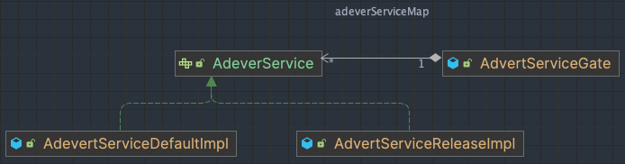

# feature-toggles-core  

***

## Description
1. 스프링부트 자바 애플리케이션에서 사용할 feature toggles 기능을 제공합니다.
2. 토글 Bean 인스턴스를 관리할 수 있게해주는 core기능을 제공합니다.

***

## Usage
1. 여러분의 스프링부트 애플리케이션에 의존성을 추가할 수 있습니다. [jitpack가이드](https://jitpack.io/#frjufvjn/feature-toggles-core)를 참고해주세요.
2. data영역과 사용자기반 routing영역 구현 책임은 사용자에게 있습니다.
3. 피처토글을 적용하면 아래와 같은 전략패턴의 구조를 갖게 됩니다.
4. [User Guide](GETTING_STARTED.md)    
5. [발표 자료](./assets/한빛앤세미나-작은서비스조금씩개선하기-피처토글-20240522-최종-pdf.pdf)    

***

## Glossary
- Feature Toggles    
  - 코드를 수정하지 않고 시스템의 동작을 바꾼다.
  - 사용자에게 새로운 기능을 빠르고 안전하게 제공한다.
  - Ref. [article in martinfowler's blog](https://martinfowler.com/articles/feature-toggles.html)
- Feature    
  토글을 위한 대상 기능을 의미
- Toggle   
  Feature에 대해 전환되는 코드 버전 혹은 전략을 의미
- Gate    
  기능을 수행하는 클래스의 캡슐화를 깨지 않으면서 특정 기능의 활성화 여부를 결정하는 역할을 수행합니다.

## Roadmap
- [x] Data와 Routing 영역에 대한 가이드 레파지토리

## Contributing
Welcome!!

## License
MIT
